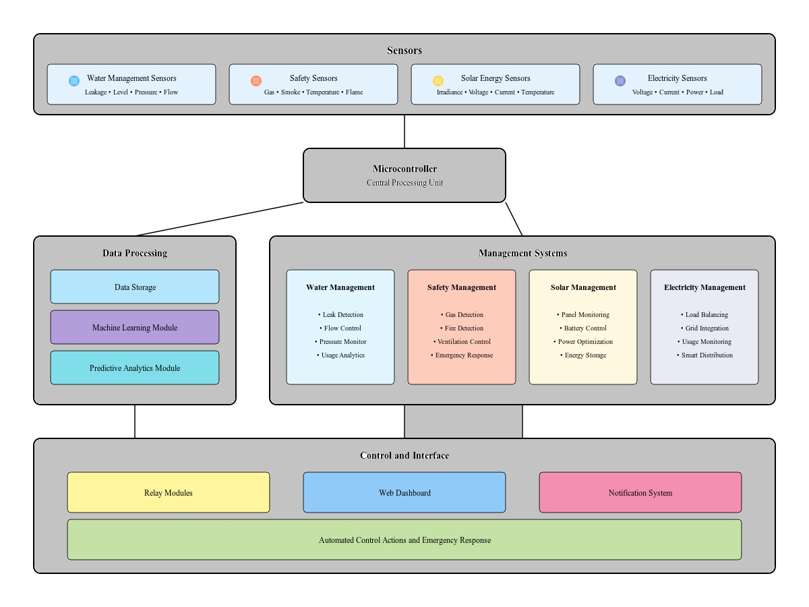
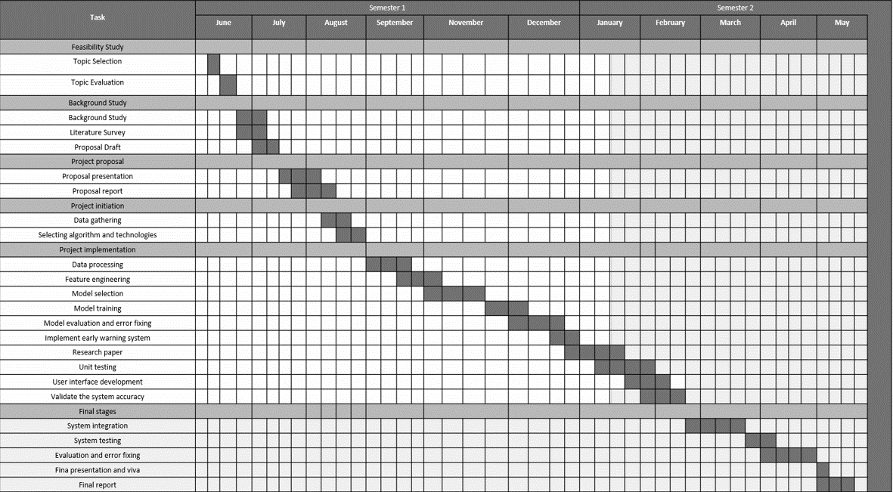

# Home Energy Management System Website 🌞🔋 ♨️🔥 💧 ⚡

# Sub Objectives
### - Gas & Fire Management System
### - Water Management System
### - Solar Management System
### - Electricity Management System

# Member Details

 ## &nbsp; &nbsp; Project Group ID - 24-25J-222
   ### &nbsp; &nbsp; &nbsp; &nbsp; &nbsp; Group Leader - IT21170584 - Sithumini K.G.P - [PrathibhaSithumini](https://github.com/PrathibhaSithu) :octocat:
   ### &nbsp; &nbsp; &nbsp; &nbsp; &nbsp; Member 2 - IT21173318 - Adhikari A.M.S.S - [ShashiSAdhikari](https://github.com/ShashiSAdhikari) :octocat:
   ### &nbsp; &nbsp; &nbsp; &nbsp; &nbsp; Member 3 - IT21173936 - Kodithuwakku K.G.K.M.J - [KaveendraKodithuwakku](https://github.com/kaveeeee) :octocat:
   ### &nbsp; &nbsp; &nbsp; &nbsp; &nbsp; Member 4 - IT21301490 - Mahanama K.T.D - [DamithaMahanama](https://github.com/DamithaMahanama) :octocat:

# Project Description
  ### As the demand for sustainable living grows, homes must evolve to manage resources efficiently and safely. The Home Energy Management System (HEMS) integrates solar, electricity, gas/fire, and water management systems into a single AI-powered platform. A key feature is the Solar Energy Management module, which uses AI techniques like long short-term memory (LSTM) and reinforcement learning to predict solar generation, schedule energy use, and manage hybrid storage systems—maximizing solar utilization and reducing grid dependence. The system also ensures safety with gas leak and fire detection using deep learning, real-time computer vision, and automated shutoff controls. Water usage is tracked with sensors and machine learning to detect leaks or overuse. Electricity management automates appliances based on occupancy, tariffs, and environment. A user-friendly web and mobile interface offers real-time monitoring, smart recommendations, and voice control. Modular and scalable, HEMS supports future features like EV charging and smart microgrid integration, making homes safer, greener, and more efficient.
  
# Tools and technologies 

##  * Software Dependencies
  ### - Python
  ### - React
  ### - Node
  ### - Mongo DB
  ### - IOT

# Architecture Diagram



# Project Management Tools
  ## Ms Planner





## 🚀 Setup & Usage  

1. Clone the repository:  
   ```bash
   git clone code
   
   ```
<!-- 
   2. Creare a Project
   ```
   npm create vite@latest hems_web -- -- template react

   ```
-->
2. Enter to Project
   ```
   cd hems_web

   ```
<!-- 3. Install Dependencies
    ```
    npm install

    ```
4. Install Tailwind Css
    ```
    npm install tailwindcss @tailwindcss/vite

    ```
5. Install Three.js
    ```
    npm i three

    ```
6. Install React Three drei 
    ```
    npm i @react-three/drei
    
    ```
7. Install React Fiber
    ```
    npm i @react-three/fiber

    ```
8. Install React Postprocessing
    ```
    npm i @react-three/postprocessing
    
    ```
9. Install Framer Motion
    ```
    npm i framer-motion
    
    ```
10. Install CountUp.js (for animations) 
    ```
    npm i countup

    ```
11. Run the Development Server
    ```
    npm run dev

    ``` -->

## ⭐ If you like this project, don't forget to star the repository! ⭐    